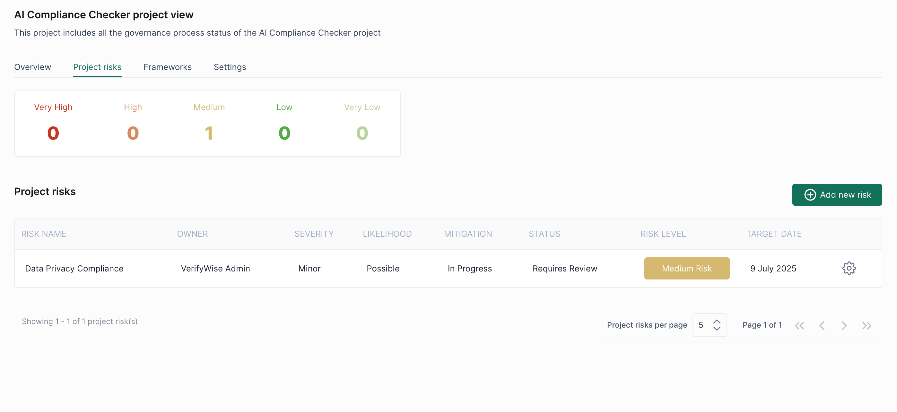

# ⛷️ Managing risks

The Risk Management system in VerifyWise provides comprehensive functionality for identifying, assessing, and mitigating risks across compliance projects. This system manages two primary risk categories: Project Risks and Vendor Risks, each with distinct workflows.

The risk management functionality includes risk identification, likelihood and severity assessment, automated risk level calculation, mitigation planning, approval workflows, and comprehensive reporting capabilities.

This section is about maintaining Project Risks. If you would like to get more information about Vendor Risks, please see [Managing Vendors](managing-vendors.md) section.

### Project risk dashboard

<figure><figcaption></figcaption></figure>

This screen gives you an overview of all risks associated with a specific AI project. In the top summary bar, each risk label shows the number of risks in that severity category.

Below the summary, the project-specific risk table includes:

* **Risk name**
* **Owner**
* **Severity** (e.g., Minor)
* **Likelihood** (e.g., Possible)
* **Mitigation status** (e.g., In Progress)
* **Status** (e.g., Requires Review)
* **Risk Level** (e.g., Medium Risk)
* **Target Date** (e.g., 9 July 2025)

To add a new risk, click **"Add new risk"**.

### Adding a new risk

When adding a new risk, a form with two tabs is displayed: **Risks** and **Mitigation**.&#x20;

**Tab 1: Risks**

<figure><figcaption></figcaption></figure>

**Required and optional fields:**

* Risk name
* Action owner
* AI lifecycle phase
* Risk description
* Potential impact
* Risk category (e.g., Strategic risk)
* Review notes (optional)

Risk level is automatically calculated by combining likelihood and risk severity.

Click **Save** to proceed or switch to the **Mitigation** tab.

**Tab 2: Mitigation**

<figure><figcaption></figcaption></figure>

This section keeps a list of mitigation status of the corresponding risk you filled in previously.

* Mitigation status
* Current risk level
* Start date
* Mitigation plan
* Implementation strategy

Residual risk level calculation is again based on likelihood and risk severity.

Under the approval section, you can select approver, approval status, start date and (optionally) recommendation notes.

Click **Save** to finalize and log the risk with mitigation details.

### Tips for using the risk management module

* Stick to clear, consistent wording when naming and describing risks.
* After applying mitigation steps, double-check the updated (residual) risk level to see if your actions had an impact.
* Keep the mitigation progress and review notes up to date so your team always knows the latest status.

\
